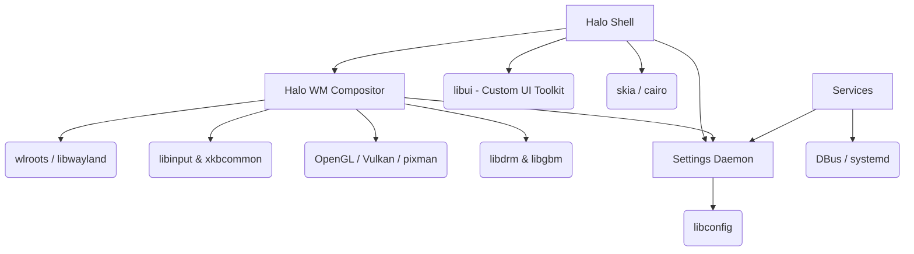

# Halo DE Architecture Overview

## Project Architecture Explanation

Halo DE is architected as a highly modular, out-of-process component system centered around a stable Wayland compositor core (`Halo WM`). The design explicitly targets production-grade performance, adopting techniques from both the Linux kernel (intrusive lists, clear ownership semantics) and modern graphics stacks (explicit sync, DMA-BUF, arena allocators).

The core philosophy is **separation of concerns via IPC**. While traditional compositors like Mutter or KWin often run the shell UI and the compositor in the same process thread, Halo DE strictly separates them:

1. **Halo WM (Compositor)**: The central Wayland server. Handles scene graph, input routing, damage tracking, KMS/DRM scheduling, and strict sandbox enforcement.
2. **Halo Shell (Client)**: A privileged Wayland client that renders panels, wallpapers, and the dashboard. It communicates with the WM via custom Wayland protocols (e.g., `halo-shell-v1`).
3. **Services (Daemons)**: Background processes for audio (PipeWire bridge), network (NetworkManager DBus client), power management (upower), and settings.
4. **Settings Daemon**: A centralized configuration registry providing live updates to all clients via a fast, memory-mapped IPC mechanism.

### Key Architectural Tenets
- **C17 First**: Pure C architecture. OOP patterns are implemented via opaque pointers and vtables, minimizing ABI fragility.
- **Fail-Fast & Recover**: Shell crashes should never crash the compositor. The compositor monitors the shell client and relaunches it if it dies.
- **Zero-Copy Pipeline**: From application buffer allocation to hardware scanout, buffers are passed as DMA-BUFs without CPU intervention.
- **Explicit Synchronization**: Eliminates implicit driver synchronization overhead, feeding Vulkan/OpenGL fences directly to the DRM KMS API.

## Dependency Map



## Module Interaction Diagram (Compositor Internals)

```
+-----------------------------------------------------------------------------------+
|                                 Halo WM (Core)                                    |
|                                                                                   |
|  +--------------------+    +---------------------+    +------------------------+  |
|  | Input Subsystem    |    | Scene Graph         |    | Protocol Handlers      |  |
|  | (Keyboard/Pointer) |--->| (Nodes, Views)      |<---| (xdg-shell, layer-shell|  |
|  +--------------------+    +---------------------+    +------------------------+  |
|            |                          |                            |              |
|            v                          v                            v              |
|  +--------------------+    +---------------------+    +------------------------+  |
|  | Seat/Focus Manager |    | Render Pipeline     |    | Wayland Server Context |  |
|  | (Pointer constr.)  |    | (Damage tracking,   |    | (wl_display, sockets)  |  |
|  +--------------------+    |  Fences, Blur)      |    +------------------------+  |
|                            +---------------------+                                |
|                                       |                                           |
|                                       v                                           |
|                            +---------------------+                                |
|                            | Output/DRM Backend  |                                |
|                            | (Pageflips, KMS)    |                                |
|                            +---------------------+                                |
+-----------------------------------------------------------------------------------+
```

## Module Boundaries & Naming Conventions

Modules follow a strict `<namespace>_<subsystem>_<action>` naming convention in C.
Example: `halo_render_pipeline_init()`.

- `compositor/`: The `halo-wm` binary source.
- `libs/libcore/`: Arena allocators, logging macros, intrusive linked list definitions (`halo_list.h`).
- `libs/libwayland/`: Abstraction layer wrapping `wlroots`. Allows future backend replacements without rewriting the compositor scene logic.
- `libs/libipc/`: Fast messaging layer used for communication between the compositor and out-of-process daemons.
- `plugins/`: Shared objects (`.so`) loaded via `dlopen`. They hook into the compositor's event loop via a stable C ABI (`halo_plugin_v1`).
